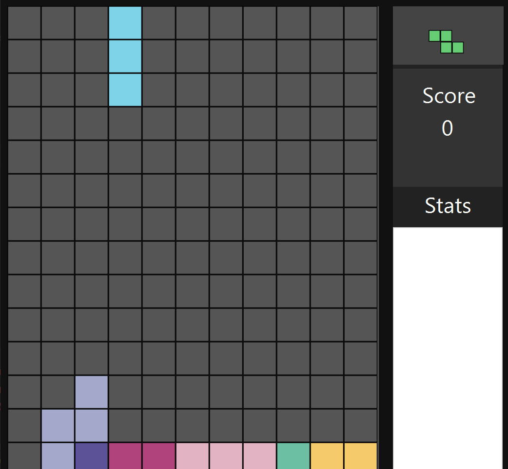

# Tetris
<h1>Tetris on JavaFX</h1>

Tetris gameplay with no supporting stats to be displayed.

<h4>Development ETA:</h4>
<h6>UI layout design: 12 hours</h6>
<h6>Back-end game logic and UX: 1 day</h6>
<h6>Debugging game: 1 day</h6>
<h6>Note: Still has some visual/game-logic bugs, but doesn't cause a crash.</h6>
